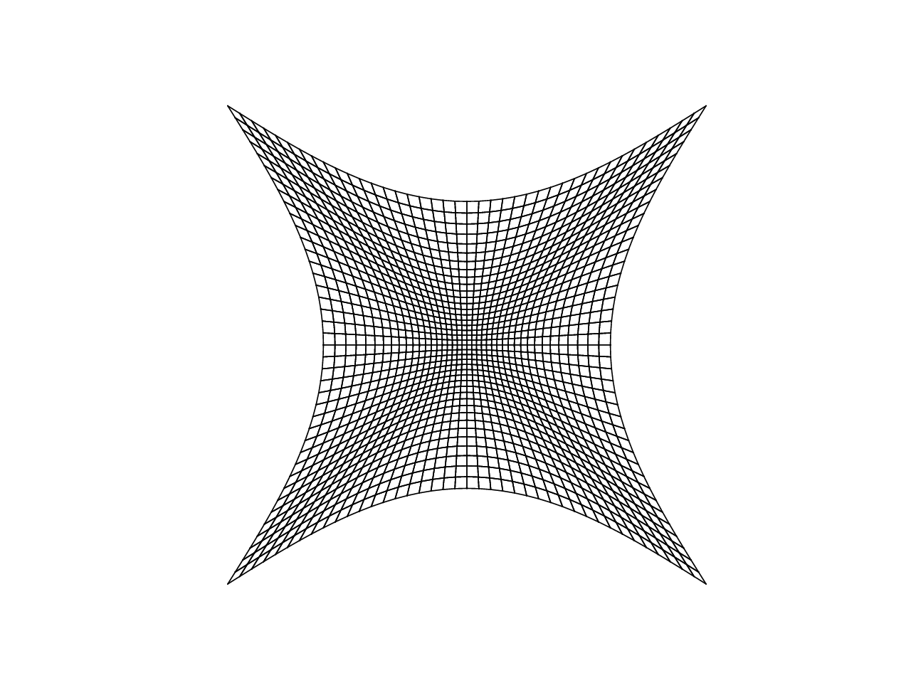

# Structured Mesh Generators

This is a simple tool for generating 2-dimensional structured
meshes. Implemented algorithms include algebraic grid generation and
solvers for the Beltrami/diffusion equations using finite difference
schemes. See the [equations PDF](./equations.pdf) for details about the
Beltrami/diffusion equations.

# Examples

See the `examples` directory for examples of generating meshes with
both algebraic generators and solutions to the diffusion equations. My
recommended approach when solving equations is to initialize the mesh
using algebraic generators, and then solve the equations. Results from
some of my examples are shown below, including initial solutions from
the algebraic generators and the final solutions given a prescribed
field to model the contravariants in the equations.

## Quadrilateral Grid Cell Mesh

Initial Solution | Final Solution
:---------------:|:--------------:|
 | 

## Triangular Grid Cell Mesh

Initial Solution | Final Solution
:---------------:|:--------------:|
 | 

# References

Liseikin, V. D. *A Computational Differential Geometry Approach to Grid Generation*. Springer, 2006.

Liseikin, V. D. *Grid Generation Methods*. Springer, 2010.
